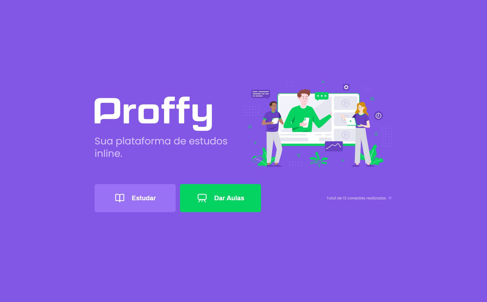
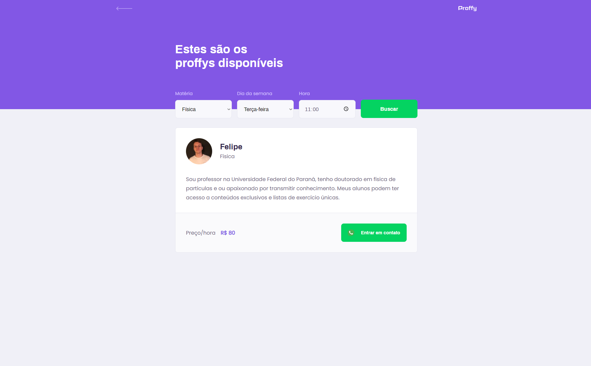
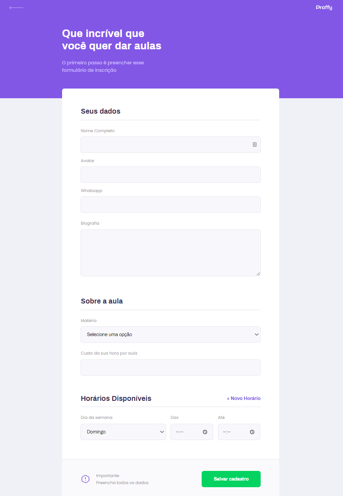
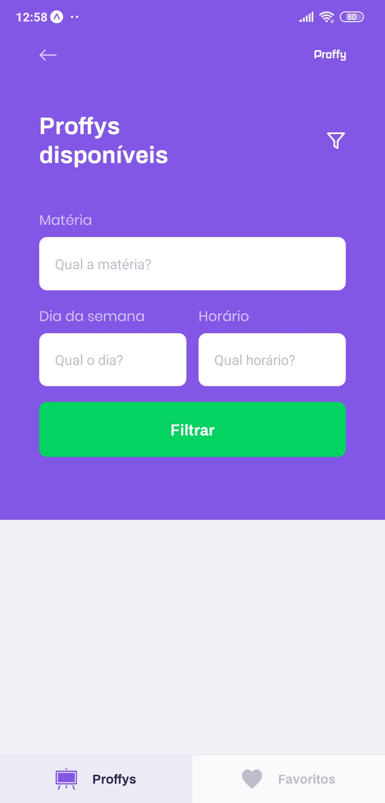

<div align="center">
   

  <h1>Proffy</h1>
  
  <h2 align="center">
    :book: Proffy é um projeto OpenSource desenvolvido num projeto da @RocketSeat na semana Next Level Week(2.0) utilizando TypeScript, Node, React e ReactNative
  </h2>
  
  ## Vizualização Web:

  <div align="center" flex-direction:"row">
    
    
    
  </div>

  ## Vizualização Mobile:

  <div align="center">
    
    
    
    
    
  </div>
  

</div>

## **:rocket: OBJETIVO**
  O projeto tem como finalidade **estabelecer uma conexão** entre **alunos e professores** (de várias matérias) 
  **por meio de disponibilidade de dias e horários, em que o aluno pode escolher o que encaixar melhor**. Solucionando um grande problema recorrente que é a **necessidade de aulas extras**, facilitando o processo de encontro de professores e alunos.

<div align="left">

#### **Website** ([React][react] + [TypeScript][typescript])

  - **[React Router Dom][react_router_dom]**
  - **[React Icons][react_icons]**
  - **[Axios][axios]**


#### **Server** ([NodeJS][node] + [TypeScript][typescript])

  - **[Express][express]**
  - **[CORS][cors]**
  - **[KnexJS][knex]**
  - **[SQLite][sqlite3]**
  - **[ts-node][tsnode]**
  
  #### **Mobile** ([React Native][react_native] + [TypeScript][typescript])

  - **[Expo][expo]**
  - **[Expo Google Fonts][expo_google_fonts]**
  - **[React Navigation][react_navigation]**
  - **[Expo Constants][expo_constants]**
  - **[Axios][axios]**

 </div>
  
  
## 🚀 Como executar o projeto

Podemos considerar este projeto como sendo divido em três partes:
1. Back End (pasta server) 
2. Front End (pasta web)
3. Mobile (pasta mobile)

💡Tanto o Front End quanto o Mobile precisam que o Back End esteja sendo executado para funcionar.

### Pré-requisitos

Antes de começar, você vai precisar ter instalado em sua máquina as seguintes ferramentas:
[Git](https://git-scm.com), [Node.js][node]. 
Além disto é bom ter um editor para trabalhar com o código como [VSCode][vscode]

Depois de realizar o GitClone, deve-se:
 
```sh
# Instalando as dependências do server:
$ cd ./server
$ yarn install

# Instalando as dependências do website:
$ cd .web
$ yarn install

# Instalando as dependências do mobile:
$ cd ./mobile
$ yarn install
```


### 🎲 Rodando o Back End (servidor)

```bash
# Vá para a pasta server
$ cd server

#Instancie o banco de dados
$ yarn knex:migrate

# Execute a aplicação em modo de desenvolvimento
$ yarn start

# O servidor inciará na porta:3333 - acesse http://localhost:3333 
```

### Utilizando o Website

```sh
# Abrindo o terminal no diretório do website:
$ cd ./web

# Executando o website no modo de desenvolvimento:
$ yarn start
```

> Se o browser não abrir automaticamente, acesse: http://localhost:3000.

### Utilizando o Mobile

Instale o aplicativo <kbd>[Expo](https://play.google.com/store/apps/details?id=host.exp.exponent&hl=en)</kbd> no seu smartphone.

```sh
# Abrindo o terminal no diretório do mobile:
$ cd ./mobile

# Executando o mobile no modo de desenvolvimento:
$ yarn start
```

Agora, abra o aplicativo do expo e no modo **LAN** faça o scan do QRCode.

> Se tiver algum problema para executar o aplicativo nesse modo, tente desabilitar o firewall da sua máquina.


<h3 align="center">
Feito com ❤️ por <a href="https://www.linkedin.com/in/felbarboza/">Felipe Barboza</a>
<br><br>
<a href="https://rocketseat.com.br">
  
</a>
</h3>

<!-- Website Links -->

[rocketseat_site]: https://rocketseat.com.br/

<!-- Techs -->

[react]: https://reactjs.org/

[typescript]: https://www.typescriptlang.org/

[node]: https://nodejs.org/en/

[leaflet]: https://react-leaflet.js.org/en/

[vscode]: https://code.visualstudio.com/

[react_native]: http://www.reactnative.com/

[vscode_sqlite_extension]: https://marketplace.visualstudio.com/items?itemName=alexcvzz.vscode-sqlite

[express]: https://expressjs.com/

[cors]: https://expressjs.com/en/resources/middleware/cors.html

[knex]: http://knexjs.org/

[sqlite3]: https://github.com/mapbox/node-sqlite3

[tsnode]: https://github.com/TypeStrong/ts-node

[feather_icons]: https://feathericons.com/

[insomnia]: https://insomnia.rest/

[react_router_dom]: https://github.com/ReactTraining/react-router/tree/master/packages/react-router-dom

[react_icons]: https://react-icons.github.io/react-icons/

[axios]: https://github.com/axios/axios

[expo]: https://expo.io/

[expo_google_fonts]: https://github.com/expo/google-fonts

[react_navigation]: https://reactnavigation.org/

[react_native_maps]: https://github.com/react-native-community/react-native-maps

[expo_constants]: https://docs.expo.io/versions/latest/sdk/constants

[yarn]: https://classic.yarnpkg.com/en/docs/install/#debian-stable
